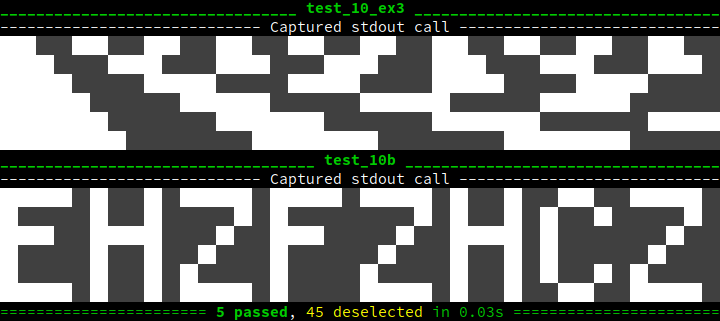

# Advent of Code 2022

My Python solutions to [Advent of Code 2022][aoc2022]. I use [pytest][] with my
[pytest-aoc][] plugin.

[aoc2022]: https://adventofcode.com/2022
[pytest]: https://pytest.org/
[pytest-aoc]: https://github.com/j0057/pytest-aoc

## Setting up the environment

1. If `direnv` is available: `direnv allow`; if not, source the environment
   variables using `. .envrc`.
2. Create a virtualenv: `python -m venv env`.
3. Install `pytest` and friends: `pip install -r requirements`.

## Running the tests

Once: `pytest -v`; filter by day: `pytest -vk day01`; continuously:
`pytest-watch -cw -- -vk day01`; only failed: `ptw -cw -- -v --lf`;
with output even if successful: `ptw -cw -- -v --lf -rP`.

## Screenshots

### Day 10: Cathode-Ray Tube

